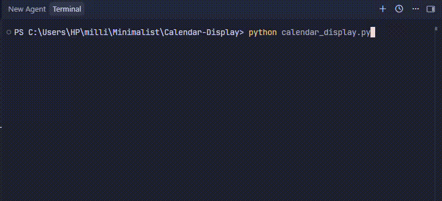

<h1 align="center">calendar cli</h1>

<p align="center">
This is a minimalist command-line calendar viewer written in Python using the built-in `calendar` module, allowing you to generate and display a formatted calendar for any given month and year.
</p>

<p align="center">

</p>

## Prerequisites

- Python 3.x installed on your system
- No external dependencies, `calendar` is part of the Python standard library

## How to Use

1. **Run the script:**

```bash
python calendar_cli.py
```

2. **Enter the year and month when prompted:**

The script will ask for a year and a month (1–12), then print a neatly formatted calendar for that month directly in the terminal.

## How It Works

**Key Functions in `calendar_cli.py`:**

- `calendar.TextCalendar(calendar.SUNDAY)`: Creates a text calendar object with weeks starting on Sunday.
- `.formatmonth(year, month)`: Generates a formatted string representation of the specified month.
- `input()`: Collects the year and month entered by the user.
- `print()`: Displays the formatted calendar in the terminal.

## Notes

- The script displays a single month at a time; it could be extended to support full year views, custom week start days, or a GUI/web interface.
- Designed for simplicity and demonstration purposes, using only Python's standard library.
