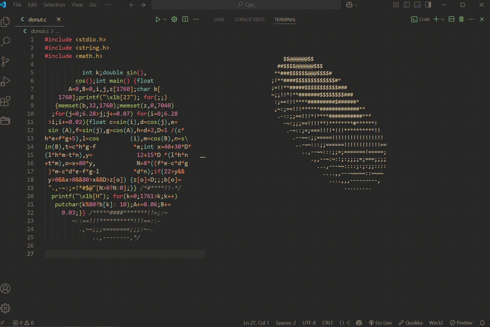
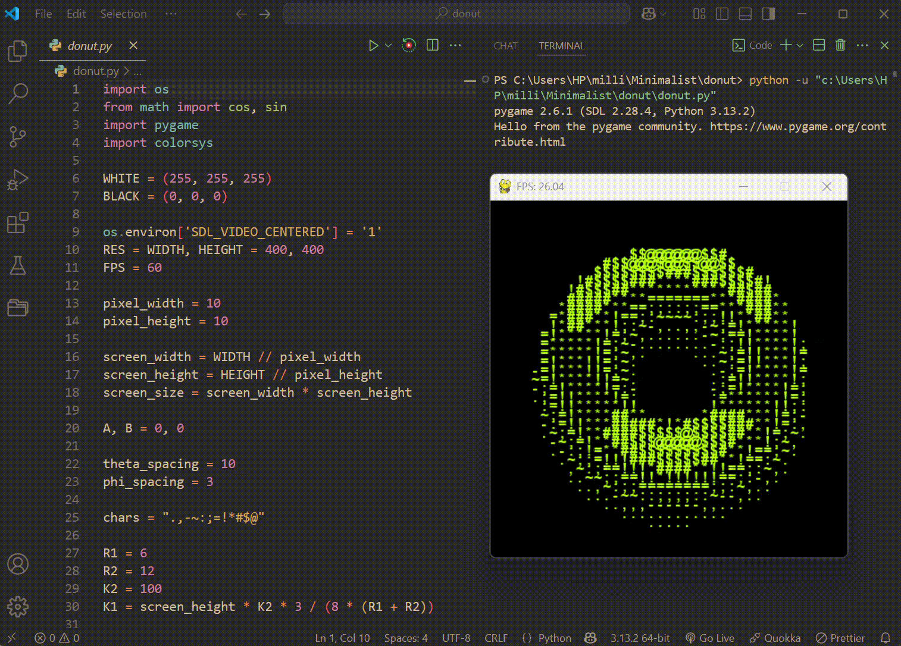

# `donut`

This is a minimalist 3D ASCII donut animation that renders a rotating torus using character-based shading. The project includes two implementations: a compact C version that runs in the terminal, and a Python version that uses Pygame to display the same effect in a colorful window.

<table>
  <tr>
    <td align="center"><b>C (Terminal)</b></td>
    <td align="center"><b>Python (Pygame)</b></td>
  </tr>
  <tr>
    <td></td>
    <td></td>
  </tr>
</table>

## Files

- `donut.c`: Source code for the terminal-based ASCII donut rendered with ANSI escape codes.
- `donut.py`: Source code for the Pygame-based donut with dynamic HSV color cycling and pause support.

## How to Use

1. **Compile and Run the C Version:**

```bash
gcc -o donut donut.c -lm
./donut
```

The C program clears the terminal and continuously renders a rotating ASCII donut using character luminance for shading.

2. **Run the Python Version:**

```bash
pip install pygame
python donut.py
```

A 400×400 window opens showing the rotating donut with smoothly cycling colors.

3. **Controls (Python Version)**

- Press `SPACE` to pause or resume the animation.
- Press `ESC` or close the window to quit.

## How It Works

**Key Concepts in `donut.c` and `donut.py`:**

- **Parametric torus**: Points on the donut surface are generated using angles `theta` and `phi`, defining the major and minor radii of the torus (`R1`, `R2`).
- **3D rotation**: Angles `A` and `B` rotate the torus around the X and Z axes on each frame, producing the spinning effect.
- **Perspective projection**: 3D coordinates are projected onto a 2D screen using a perspective factor (`K1`, `K2`), so farther points appear smaller.
- **Z-buffer**: A depth buffer stores the closest surface at each screen position, ensuring only the nearest character is drawn (hidden surface removal).
- **Luminance shading**: Surface normal orientation is used to compute brightness, mapping each point to one of the ASCII characters in `".,-~:;=!*#$@"` from darkest to brightest.
- **`printf("\x1b[2J")` / `printf("\x1b[H")` (C)**: ANSI escape codes clear the screen and move the cursor to the top-left on each frame for smooth terminal animation.
- **`pygame` (Python)**: Renders each character in a grid with HSV color cycling via `colorsys.hsv_to_rgb()` for a colorful visual effect.

**Rendering Loop:**

Both implementations follow the same core loop:

1. Clear the output buffer and z-buffer.
2. Iterate over `theta` and `phi` to sample points on the torus surface.
3. Apply rotation, project to 2D, and compute luminance.
4. Write the appropriate ASCII character if the point is closer than anything already at that position.
5. Display the frame and increment rotation angles `A` and `B`.

## Notes

- The C version runs entirely in the terminal with no external dependencies beyond the C standard library and `math.h` (`-lm` flag required at link time).
- The Python version requires `pygame` and runs in a dedicated window at 60 FPS.
- Both programs run in an infinite loop until manually stopped (Ctrl+C in the terminal for C, ESC or window close for Python).
- This is a minimalist demonstration of 3D rendering using ASCII art; it can be expanded with adjustable torus dimensions, rotation speed, or multi-client streaming over a network.
