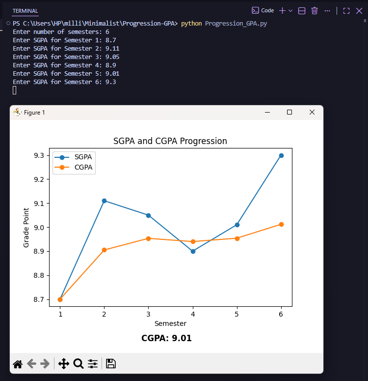

# `progression gpa`

A minimalist Python tool that takes semester wise SGPA input and plots the SGPA/CGPA progression using matplotlib.



## Prerequisites

- Python 3.x installed on your system
- `matplotlib` library:

```bash
pip install matplotlib
```

## How to Use

1. **Run the script:**

```bash
python sgpa_cgpa_tracker.py
```

2. **Enter your data when prompted:**

The script will ask for the number of semesters, followed by the SGPA for each semester one by one.

3. **View the graph:**

A plot window opens showing your SGPA and CGPA trend across semesters, with the final CGPA displayed at the bottom.

## How It Works

**Key Functions/Logic in `sgpa_cgpa_tracker.py`:**

- `input()`: Collects the number of semesters and the SGPA for each one.
- Running total: Keeps a cumulative sum of SGPA values, dividing by the semester count to compute CGPA after each semester.
- `plt.plot()`: Plots the SGPA and CGPA lists against the semester numbers, each as its own line with markers.
- `plt.xlabel()` / `plt.ylabel()` / `plt.title()`: Label the axes and title the chart.
- `plt.legend()`: Distinguishes the SGPA and CGPA lines on the graph.
- `plt.figtext()`: Displays the final CGPA as bold text below the plot.
- `plt.show()`: Renders the graph in a window.

## Notes

- Assumes valid numeric SGPA input; no input validation is performed.
- Could be extended to save the plot as an image, export data to CSV, or add credit-weighted CGPA calculation.