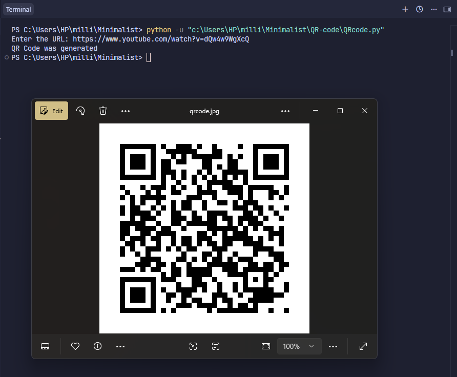

# qr code generator

This is a minimalist Python script that generates a QR code from any URL you provide, using the `qrcode` library, and saves it as an image file to a location of your choice.



## Prerequisites

- Python 3.x installed on your system
- The `qrcode` library with image support:

```bash
pip install qrcode[pil]
```

## How to Use

1. **Set the output path:**

Open `qr_generator.py` and update the `file_path` variable to the location where you want the QR code image saved:

```python
file_path = "C:\\Users\\HP\\Downloads\\qrcode.jpg"
```

2. **Run the script:**

```bash
python qr_generator.py
```

3. **Enter a URL when prompted:**

The script will generate a QR code for the URL and save it to the specified path.

```
Enter the URL: https://example.com
QR Code was generated
```

## How It Works

**Key Functions in `qr_generator.py`:**

- `qrcode.QRCode()`: Creates a QR code object to hold the encoding configuration.
- `.add_data(url)`: Adds the URL data to be encoded into the QR code.
- `.make_image()`: Renders the QR code as an image.
- `.save(file_path)`: Saves the generated image to the specified file path.
- `input()`: Collects the URL entered by the user.

## Notes

- The output file path is currently hardcoded and needs to be updated manually in the script before running.
- Could be extended to accept the file path as user input, support other image formats, or allow custom QR code colors/styling.